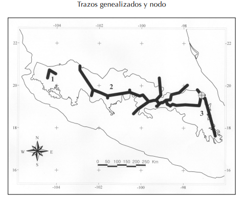
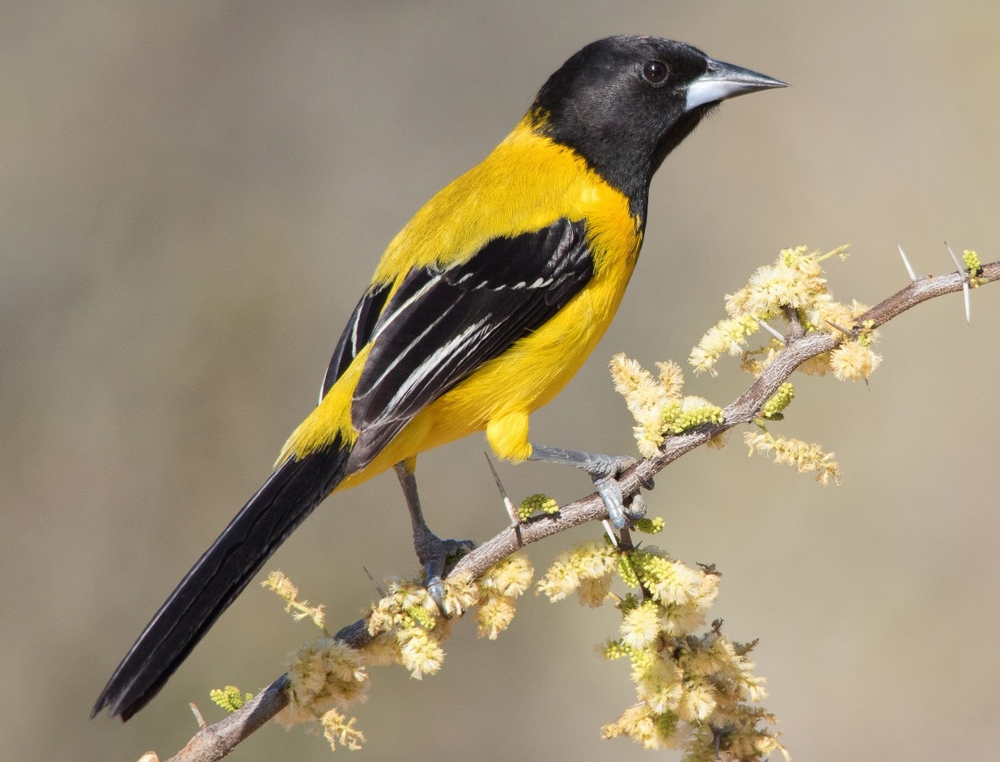
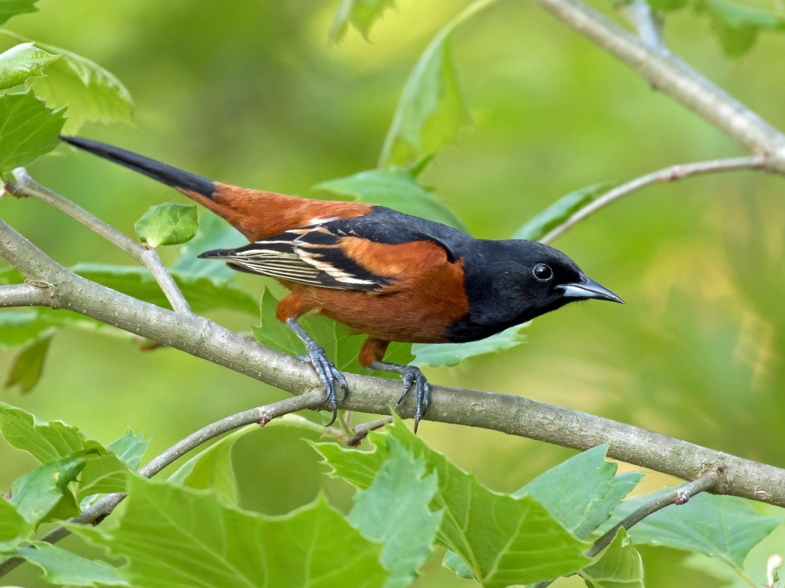
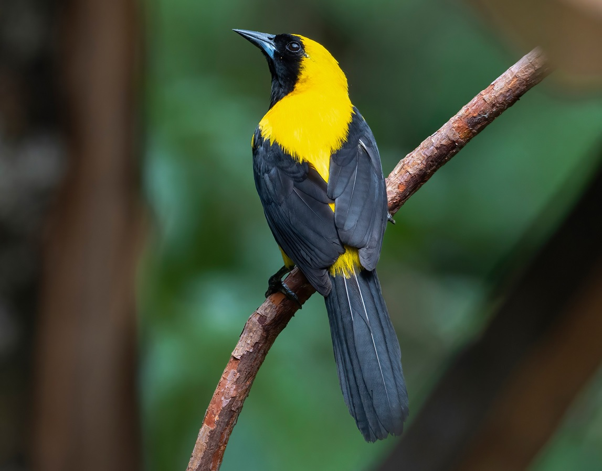
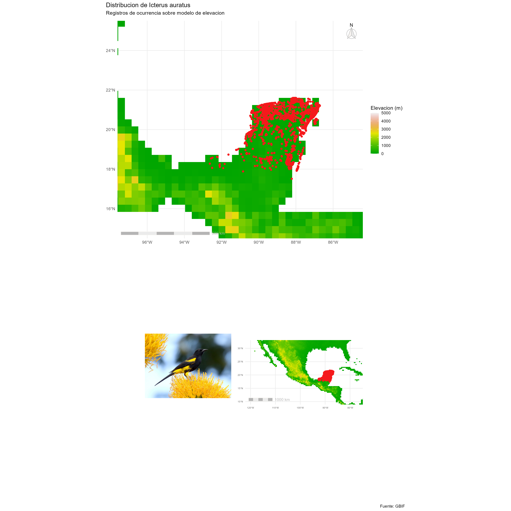
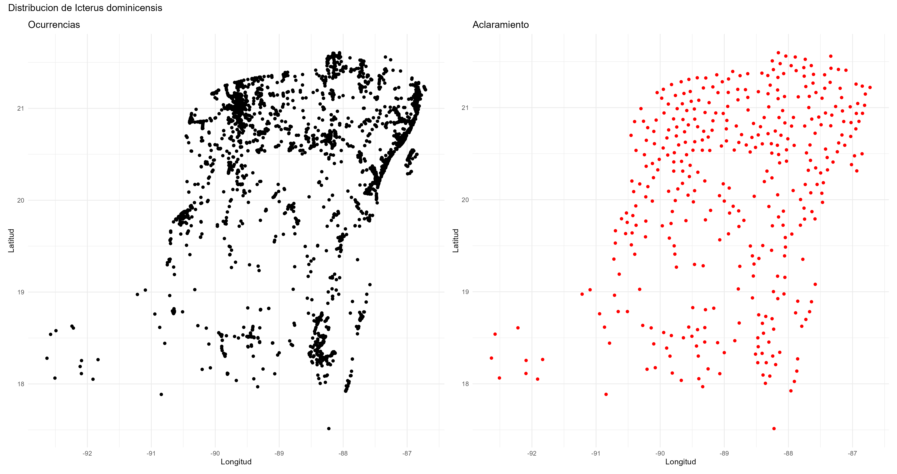
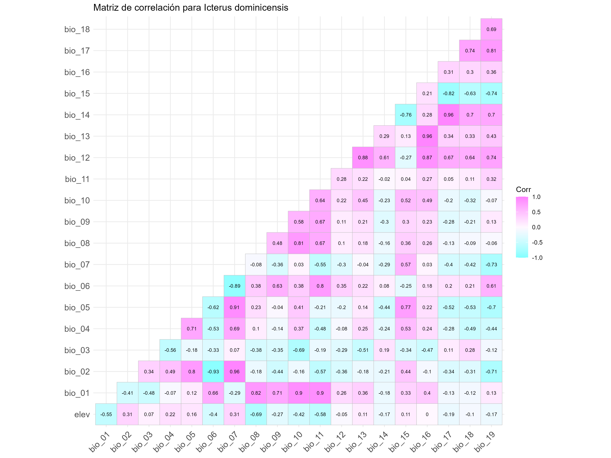
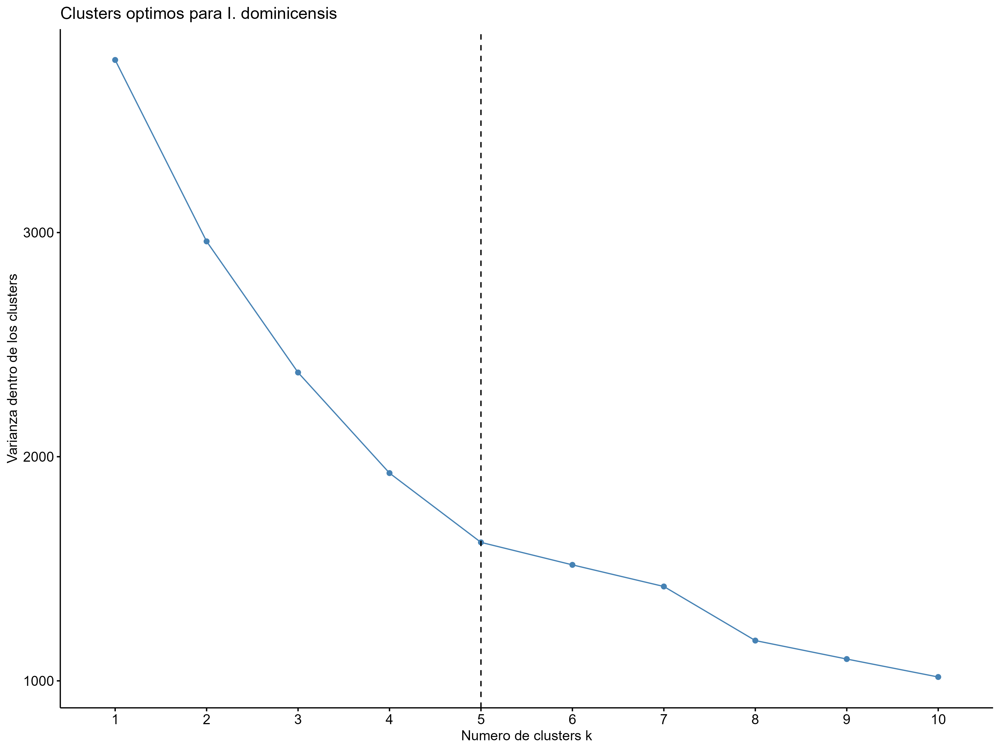
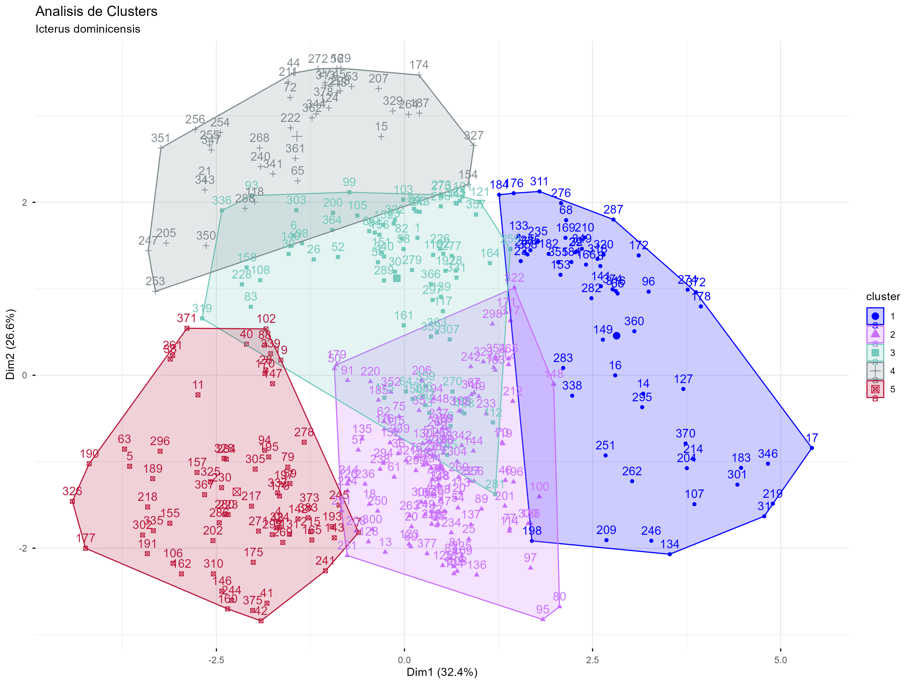

# **Icterus proyect**

Este proyecto forma parte de mi tema de investigación: Distribución geográfica del género Icterus, Brisson, 1760 (Icteridae) y sus implicaciones para la conservación. Que pretende identificar zonas con orígenes compuestos (nodos) para priorizar sitios de protección. El método utiliza trazos que buscan describir patrones de distribución históricos, la intersección de estos trazos se denomina nodos.

[](https://www.redalyc.org/articulo.oa?id=30018455002)

Los datos utilizados son registros geográficos de los géneros Icterus, Bursera y Sceloporus obtenidos a partir de búsquedas de presencia en el banco de datos del portal de GBIF (Global Biodiversity Information Facility, www.gbif.org/). Revisi'on previa en portal.

## Análisis clúster

Antes de localizar los trazos es importante realizar un análisis clúster, este actúa como un "filtro" que identifica patrones consistentes y repetidos. Su objetivo fundamental es identificar patrones. Esto permite identificar tendencias biogeográficas consistentes en el conjunto de datos (previo a los trazos individuales). El análisis clúster es una forma de análisis donde las observaciones se dividen en grupos significativos que comparten características comunes entre sí.

[](https://birdsoftheworld.org/bow/species/audori/cur/introduction)

### ¿Existen patrones generales de distribución en mis conjuntos de datos?

Se consultaron 19 bases de datos para el género Icterus, 93 para Bursera y 97 para Sceloporus, para especies distribuidas en México. Inicialmente cada una cuenta con 226 variables, con registros desde el año 1887 hasta 2025. El número de observaciones varía desde 42 hasta 1 943 792.





## Icterus dominicensis

Previo al análisis clúster se debe cuidar la calidad de los datos, realicé una limpieza de errores y bases de datos origen, asi como NA, resultando en 4 639 registros filtrados.



### Extracción de variables bioclimáticas

Usando capas raster y vectoriales con información bioclimática y elevación se generó una base de datos con información de cada una de las variables para cada registro georeferenciado y se obtuvo una base con 26 variables.

### Aclaramiento de coordenadas

Se encontró un marcado sobremuestreo en los registros, por lo que se realizó un aclaramiento usando la función spthin.



### Correlación de variables

Para encontrar que variables pueden sezgar el resultado por estar fuertemente correlacionadas se ejecutó un análisis de correlación de variables usando corrplot.



### Clúster Kmeans

Una vez preparados los datos y eliminando las variables correlacionadas del análisis se realizó un anális cluster usando el método kmeans, para encontrar el número de clúster óptimio se utilizó fviz_nbclust, que encuentra varianza dentro de los clusters en función del número de clusters (k).



Visualización de clústers



## Código

### Librerías

Para una gestión de paquetes más eficiente y reproducible, pacman.

```{r}
#install.packages("pacman")
library(pacman)
p_load("tidyverse",
       "dplyr",
       "here",
       "readr",
       "rgbif",              #descargar datos de ocurrencias
       "sf",                 #manipulación  de datos vectoriales
       "rworldxtra",         #datos vectoriales de los paises del mundo
       "usethis",            #credenciales  
       "CoordinateCleaner",  #limpieza de coordenadas
       "geodata",            #datos geoespaciales complemenatarios
       "ggspatial",          #auxiliar para visualizar datos espaciales
       "terra",              #datos raster  
       "tidyterra",          #maniipulación de raster
       "paletteer", 
       "cluster",
       "spThin",
       "colorspace",
       "ggcorrplot",         #diagrama de correlaciones 
       "ggplot2",            #graficos  
       "factoextra",         #estimación de clústers
       "ggpubr",             #visualización cluster
       "patchwork",
       "magick",
       "jpeg",
       "grid",
       "cowplot",            #combinar gráficos de ggplot2
       "caret",              #correlacion de variables
       "RColorBrewer")             
```

```{r}
#update.packages(ask = FALSE)
```

[Credenciales]{style="text-decoration:underline"}

Automatiza y permite guardar información sin ser expuesta directamente en el código.

Reiniciar cada vez que se edita.

```{r}
#usethis::edit_r_environ()

#gbif_user="usuario_gbif"
#gbif_pwd="contraseña_gbif"
#gbif_email="email_gbif"

```

### Consultas

```{r}
consulta_A <- name_suggest("Icterus")$data 
consulta_1 <- name_backbone("Icterus auratus") 
consulta_2 <- name_backbone("Icterus dominicensis")
```

[Clave]{style="text-decoration:underline"}

Asignación de keyid para descarga.

```{r}
keyid <- name_backbone("Icterus auratus")$usageKey
keyid <- name_backbone("Icterus dominicensis")$usageKey
```

(keyid)

### Descarga

[Asignar credenciales]{style="text-decoration:underline"}

Llama el archivo environ y asigna.

```{r}
#usethis::edit_r_environ() 
#user <- Sys.getenv("gbif_user") 
#pwd <- Sys.getenv("gbif_pwd") 
#email <-Sys.getenv("gbif_email")
```

[Solicitar la descarga]{style="text-decoration:underline"}

Todas las ocurrencias georeferenciadas, sin problemas de georeferenciacion con estatus presente.

```{r}
#descarga_gbif <- occ_download( pred("taxonKey", keyid),
#                               pred("hasCoordinate", TRUE),
#                               pred("hasGeospatialIssue", FALSE), 
#                               pred("occurrenceStatus","PRESENT"),
#                               user = user, 
#                               pwd = pwd, 
#                               email = email )
```

para obtener DOI y ver el estado de la solicitud

```{r}
#occ_download_wait('0002799-251025141854904')
#print(descarga_gbif)
```

DOI1: 10.15468/dl.hzpadv

DOI2: 10.15468/dl.hzpadv

importar y descomprimir

```{r}
#df_gbif2 <- descarga_gbif%>%
#  occ_download_get() %>%
#  occ_download_import()
```

\*\*para errores en zip, forzar nueva descarga

```{r}
#df_gbif <- descarga_gbif %>%
#  occ_download_get(overwrite = TRUE) %>% #sobreescribe
#  occ_download_import(path = tempdir())
```

\*\*para acceder a descargas previas

```{r}
df_gbif <- occ_download_get('0002799-251025141854904') %>%
 occ_download_import()
```

### Limpieza

[Limpieza de coordenadas]{style="text-decoration:underline"}

Elimina duplicados y ejecuta test para limpiar errores comunes. value = "flagged"

```{r}
df_cleaning <- df_gbif %>% 
  cc_equ(test = "identical", #"absolute"
         value = "clean")%>% 
  clean_coordinates(tests = c("capitals",
                              "centroids", 
                              "institutions", 
                              "seas",
                              "zeros"),
                    value = "clean",
                    verbose = TRUE)%>% #informe de proceso
  write_csv("R_Icterus/I_data/I_10_clean.csv")
```

exploración

```{r}
unique(df_cleaning$countryCode)
unique(df_cleaning$basisOfRecord)
unique(df_cleaning$institutionCode)
```

[Gráfico por institución]{style="text-decoration:underline"}

```{r}
df_cleaning_grf <- df_cleaning %>% 
    ggplot(aes(x = institutionCode, 
             fill = institutionCode))+
  geom_bar()+
  coord_flip()+
  scale_fill_brewer(palette = "Set3")+
  theme_minimal()+
  theme(legend.position = "none")+
  labs(title = "Registros por Institucion",
    x = "Institucion",
    y = "Numero de Registros")
df_cleaning_grf
```

limpieza base de datos y geometrías duplicada

```{r}
df_clean <- df_cleaning %>%
  filter(!is.na(institutionCode)) %>%
  distinct(decimalLatitude, decimalLongitude, .keep_all = TRUE) %>% #elimina puntos duplicados, keep conserva todas las columnas
  select(gbifID, species, decimalLatitude, decimalLongitude, month, year) %>% #selecciona en el orden dado 
  write_csv("R_Icterus/I_data/I_10_clean.csv")
df_clean

```

(df_clean)

### Mapa inicial

[Capas]{style="text-decoration:underline"}

Dataframe a archivo sf (vectorial), se definen las columnas con las coordenadas y el CRS (Coordinate Reference System) WGS84 - Sistema Geodésico Mundial 1984

```{r}
shp_clean <- df_clean %>% 
  st_as_sf(coords = c("decimalLongitude", "decimalLatitude"), crs= 4326)
```

union de df inicial con vector para conservar columnas de coordenadas separadas para el adelgazamiento, quitamos columnas duplicadas y renombramos

```{r}
shp_clean <- full_join(shp_clean, df_clean, by = "gbifID")%>%
  select(!any_of(c("species.y", "month.y", "year.y")))%>%
  rename(species = species.x,
         month = month.x,
         year = year.x)
shp_clean
```

capa altura

```{r}
alt <- worldclim_global(var="elev", res=0.5, path=tempdir())
```

carga archivos vectoriales de la nube

```{r}
data(countriesHigh)
Mundo <- st_as_sf(countriesHigh) 
```

[Preparación de mapas]{style="text-decoration:underline"}

mapa México

```{r}
map_ini <- ggplot() +
  geom_spatraster(data = alt) +
  geom_sf(data = shp_clean, aes(col = species), col = "#F5191C") +
  scale_fill_paletteer_c("grDevices::terrain.colors",
                         limits = c(0, 5000),
                       na.value = "transparent",
                       guide = "none")+
  coord_sf(xlim = c(-120, -77), ylim = c(32, 10)) +
  annotation_scale(location = "bl",
    width_hint = 0.4,
    unit_category = "metric",
    bar_cols = c("#B5B5B5", "#EBEBEB"),
    text_col = "#B5B5B5",
    line_col = "#F8F5F2")+
  theme_minimal()+
  theme(axis.text = element_text(size = 5))
        
map_ini
```

acercamiento

```{r}
map_ini_close <- ggplot()+
  geom_spatraster(data= alt)+
  geom_sf(data= shp_clean, aes(col = species), col="#F5191C")+
  scale_fill_paletteer_c("grDevices::terrain.colors",
                         limits = c(0, 5000),
                         na.value = "transparent",
                          name = "Elevacion (m)", 
                         breaks = seq(0, 5000, by = 1000))+
  coord_sf(xlim = c(-97, -85), ylim = c(25, 15))+
  annotation_north_arrow(
    location = "tr",  # ← Agrega la ubicación (top-right recomendado)
    which_north = "true",
    style = north_arrow_fancy_orienteering(
      fill = c("#F8F5F2", "#EBEBEB"),
      line_col = "#B5B5B5"),
    height = unit(1.2, "cm"),
    width = unit(1.2, "cm")) +
  annotation_scale(
    location = "bl",
    width_hint = 0.4,
    unit_category = "metric",
    bar_cols = c("#B5B5B5", "#EBEBEB"),
    text_col = "#B5B5B5",
    line_col = "#F8F5F2")+
  theme_minimal()
map_ini_close
```

cargar imagen y convertir en objeto ggplot

```{r}
path <- "R_Icterus/I_data/I_dominicensis.jpeg"
img <- readJPEG(path, native = TRUE)
cow_final <- ggdraw() + 
  draw_image(image = img,
             x = 0.1, y = 0.1,
             scale = 1)
cow_final
```

mapa combinado

```{r}
map_dist <- map_ini_close / ( cow_final | map_ini )  + 
  plot_annotation(
    title = "Distribucion de Icterus auratus",
    subtitle = "Registros de ocurrencia sobre modelo de elevacion",
    caption = "Fuente: GBIF")
map_dist

ggsave("R_icterus/I_salidas/map_dist.png",
       plot = map_dist,
       dpi = 300,
       width = 15,
       height = 15,
       units = "in")

```

(shp_clean,

alt)

### Extracción de variables bioclimáticas

[Worldclim]{style="text-decoration:underline"}

Datos ambientales (variables bioclimáticas)

```{r}
#env <- worldclim_global(var = "bio", res = 0.5, path = "datos_wc")
```

guardar y asignar rds

```{r}
#saveRDS(env, "datos_wc/climate/wc2.1_30s/bio_enviromental.rds")
env <- readRDS("datos_wc/climate/wc2.1_30s/bio_enviromental.rds")
```

renombrar las variables para mayor claridad

sprintf(formato de 2 dígitos)

```{r}
v_names <- vector()
for(i in 1:19){
  v_names[i] <- paste0("bio_", sprintf("%02d", i)) 
}
v_names
```

asigna nombre con el vector

```{r}
names(env) <- v_names
names(env)
```

[Altura]{style="text-decoration:underline"}

coordenadas a sf y extracción

```{r}
coord_elev <- shp_clean
puntos_sf <- st_as_sf(coord_elev, coords = c("lon", "lat"), crs = 4326)

elevaciones <- terra::extract(alt, puntos_sf)

```

columna elev al shp puntos_sf

```{r}
puntos_sf$elev <- elevaciones$wc2.1_30s_elev

```

[Bioclimáticas]{style="text-decoration:underline"}

coordenadas y extracción

```{r}
coord_bio <- shp_clean
env_icter <- terra::extract(env, coord_bio) #extract, capa ambiental y el lugar al que queremos enviar la información

```

combina objetos data.frames por columnas horizontalmente

```{r}
df_icter <- cbind.data.frame(puntos_sf, env_icter)%>%
  filter(!is.na(elev))%>% #quita NA
  select(-ID)%>%
  write_csv("R_Icterus/I_data/I_10_clean.csv")


```

(df_icter)

### Adelgazamiento

\*\*

```{r}
df_icter <- read.csv("R_Icterus/I_data/I_10_clean.csv")
```

visualización de ocurrencias

```{r}
ocurrencias <- ggplot(df_icter, aes(x = decimalLongitude, y = decimalLatitude)) +
  geom_point() +
  labs(x = "Longitud",
    y = "Latitud", 
    title = "Ocurrencias") +
  theme_minimal()
ocurrencias
```

adelgazamiento

```{r}
set.seed(123)
thin( loc.data = df_icter,
      lat.col =  "decimalLatitude", long.col = "decimalLongitude", 
      spec.col = "species", 
      thin.par = 10, reps = 100, 
      locs.thinned.list.return = FALSE, 
      write.files = TRUE, 
      write.log.file = FALSE,
      out.dir = here("R_Icterus", "I_data"),
      out.base = "I_10")
```

visualizar y guardar puntos adelgazados

```{r}
map_thin <- read_csv("R_Icterus/I_data/I_10_thin1.csv") %>%
  ggplot(aes(decimalLongitude, decimalLatitude)) +
  geom_point(color = "red") +
  labs(x = "Longitud",
    y = "Latitud", 
    title = "Aclaramiento") +
  theme_minimal()

map_thin
```

```{r}
map_spthin <- wrap_plots(ocurrencias, map_thin, nrow = 1) +  # ← wrap_plots explícito
  plot_annotation(title = "Distribucion de Icterus dominicensis")

map_spthin

ggsave("R_icterus/I_salidas/mapthin_10.png",
       plot = map_spthin,
       dpi = 300,
       width = 17,
       height = 9,
       units = "in")
```

[Recuperación de id]{style="text-decoration:underline"}

asignación de ids y adelgazamiento

```{r}
inicial <- df_icter
thin1 <-  read_csv("R_Icterus/I_data/I_10_thin1.csv")

```

join usando las coordenadas y la especie como clave, "thin1" = "inicial"

```{r}
icter_spthin <- thin1 %>% 
  left_join(inicial,
            by = c("species" = "species",
                   "decimalLongitude" = "decimalLongitude",
                   "decimalLatitude" = "decimalLatitude" ))%>%
  write_csv("R_Icterus/I_data/I_10_clean.csv")

which(is.na(icter_spthin$gbifID))  #Verificar NAs para buscar errores de no coincidencia
```

[Cuántos registros se conservaron]{style="text-decoration:underline"}

Leer el archivos y contar filas

```{r}
datos_inicial <- nrow(inicial)
datos_fin <-nrow(thin1)
datos_elim <- datos_inicial - datos_fin 
print(paste0("Thin/ Numero inicial: ", datos_inicial, ", eliminados: ", datos_elim, ", Numero final: ", datos_fin))
```

(icter_spthin)

### Correlación de variables

[Matriz]{style="text-decoration:underline"}

subselecciona del data, quita ID y species...

```{r}
matriz_cor <- cor(subset(icter_spthin, select = -c(species, decimalLatitude, decimalLongitude, month, year, gbifID, geometry))) 
```

[Correlograma]{style="text-decoration:underline"}

```{r}
corr <- ggcorrplot(matriz_cor, #matriz de correlacion
                   hc.order = FALSE, 
                   type = "lower", 
                   lab = TRUE, 
                   lab_size = 3, 
                   colors= c("#80FFFF", "#FFF7FF", "#FF80FF"),
                   ggtheme = theme_minimal())+
  labs(title = "Matriz de correlacion para Icterus dominicensis")
corr

ggsave("R_Icterus/I_salidas/corr.png", 
       plot = corr,
       dpi = 300,
       width = 12,   
       height = 9,
       units = "in")
```

eliminar variables altaamente correlacionadas

```{r}
var_elim <- findCorrelation(matriz_cor, cutoff = 0.7, names = TRUE)
var_elim

icter_corr <- icter_spthin %>%
 select(-all_of(var_elim))%>%
  write_csv("R_Icterus/I_data/I_10_corr.csv")
```

(icter_corr)

### Clùsters

escalado

```{r}
df_kmeans <- icter_corr %>%
  select(-month, -year, -gbifID, -geometry, -decimalLongitude, -decimalLatitude) %>%
  select(where(is.numeric)) %>%
  scale() %>%
  as.data.frame()

```

A medida que aumenta el valor de k, la varianza dentro de los clusters tiende a disminuir. La curva o “codo” indica que más allá agregar más clusters tiene poco valor adicional en términos de reducir la varianza dentro de los clusters.

```{r}
agrupamiento <- fviz_nbclust(df_kmeans, kmeans, method = "wss") +
  geom_vline(xintercept = 5, linetype = 2)+
  labs(title = "Clusters optimos para I. dominicensis",
       x = "Numero de clusters k",
       y = "Varianza dentro de los clusters")
agrupamiento

ggsave("R_Icterus/I_salidas/I_10_grup.png", 
       plot = agrupamiento,
       dpi = 300,
       width = 12,   
       height = 9,
       units = "in")
```

búsqueda de clústers (kmeans)

```{r}
set.seed(123)
icter_kmeans <- kmeans(df_kmeans, 5, nstart = 25)
table(icter_kmeans$cluster)
```

Visualización

```{r}
kmeans_grf <- fviz_cluster(icter_kmeans, data = df_kmeans,
                           palette = c("#0000FF", "#C870FF", "#74C9BC", "#7F8A8F", "#BB173A", "#C4D8F3", "#D33682","#8AD6E4"),
                           ggtheme = theme_minimal())+
  labs(title = "Analisis de Clusters",
    subtitle = "Icterus dominicensis")
kmeans_grf

ggsave("R_Icterus/I_salidas/I_10_kmeans.png", 
       plot = kmeans_grf,
       dpi = 300,
       width = 12,   
       height = 9,
       units = "in")

```

tomando los datos iniciales(icter_corr) crea una columna cluster (posterior kmeans) y filtra cluster 1

```{r}
icter_clusters <- icter_corr %>%
  mutate(cluster = icter_kmeans$cluster)%>%
  filter(cluster != 1 ) %>%
  write_csv("R_Icterus/I_data/I_10_kmeans.csv")

```

cuántos registros se conservaron

```{r}
datos_ini <- nrow(icter_corr)
datos_fin <-nrow(icter_clusters)
datos_elim <- datos_ini - datos_fin 

print(paste0("Kmeans/ Numero inicial: ", datos_ini, ", eliminados: ", datos_elim, ", Numero final: ", datos_fin))
```
